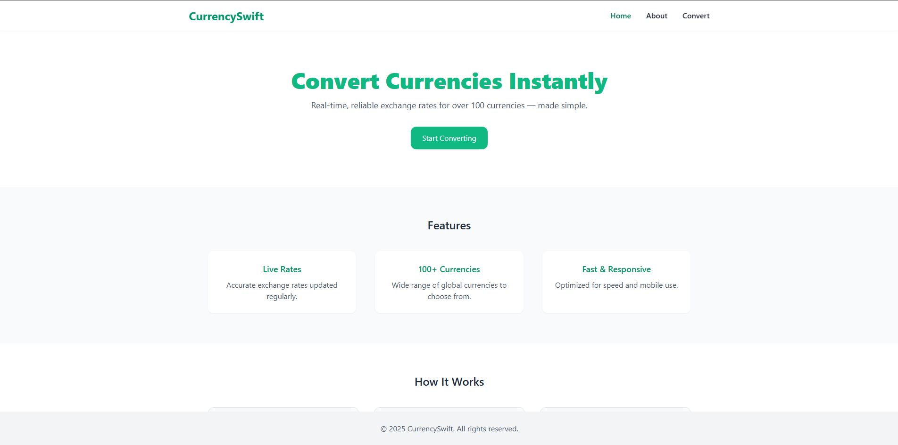
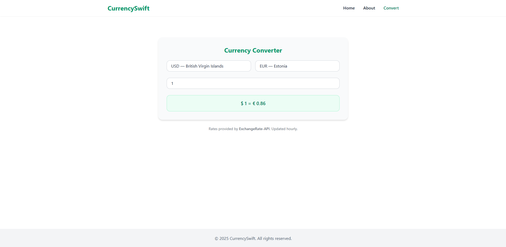

## 🌍 CurrencySwift

A sleek and responsive web-based currency converter built with **React**, **Tailwind CSS**, and **Framer Motion**, using real-time exchange rates from **ExchangeRate-API** and country/currency metadata from **REST Countries API**.

---

### 🔧 Features

* 🌐 **Live Currency Conversion** — Get real-time exchange rates between currencies.
* 🔎 **Smart Searchable Dropdowns** — Select currencies by name or code, with flags and symbols.
* 💱 **Over 150+ Currencies Supported** — Data fetched dynamically from the REST Countries API.
* 🧮 **Precision Calculations** — Amount is multiplied by live exchange rate with up to 2 decimal precision.
* 💡 **Elegant UI** — Styled with Tailwind CSS, animated with Framer Motion.
* 📱 **Responsive Design** — Fully optimized for mobile, tablet, and desktop views.
* 🔁 **Add "Swap" Button** — Quickly switch between the from and to currencies.
* ⌨️ **Keyboard Navigation** — Navigate dropdown items using arrow keys and select with Enter.

---

### 📦 Tech Stack

| Technology             | Purpose                       |
| ---------------------- | ----------------------------- |
| **React**              | Frontend UI                   |
| **Tailwind CSS**       | Styling and responsive design |
| **Framer Motion**      | Page animations               |
| **ExchangeRate-API**   | Real-time exchange rates      |
| **REST Countries API** | Currency codes, names, flags  |

---

### 🚀 Getting Started

#### 1. Clone the repo

```bash
git clone https://github.com/Dev-Rodiyat/CurrencySwift.git
cd CurrencySwift
```

#### 2. Install dependencies

```bash
npm install
```

#### 3. Start development server

```bash
npm run dev
```

---

### 🖼️ Screenshots




---

### 🧠 How It Works

* On page load, the app fetches all countries from the [REST Countries API](https://restcountries.com/) and extracts:

  * `currencyCode`
  * `currencyName`
  * `currencySymbol`
  * `country name` and `flag`
* When a user selects currencies and enters an amount:

  * The app fetches live exchange rates from [ExchangeRate-API](https://www.exchangerate-api.com/).
  * The result is calculated and shown with both **currency symbols** and **codes**.

---

### ✨ TODO / Improvements

* Add historical exchange rate charts 📊
* Implement dark mode toggle 🌙
* Add offline fallback / caching
* Support crypto conversion

